# Подготовка к работе с помощью Zabbix User Management

In this chapter, we will work on creating our first user groups, users, and user roles. It's very important to set these up in the correct manner, as they will give people access to your Zabbix environment with the correct permissions. By going over these things step by step, we will make sure we have a structured Zabbix setup before continuing on with this book.

As a bonus, we will also set up some advanced user authentication using SAML to make things easier for your Zabbix users and provide them with a way to use the login credentials they might already be using throughout your company. We will go over all these steps in order of the following recipes:

- Creating user groups
- Using the new Zabbix user roles
- Creating your first users
- Advanced user authentication with SAML

## Technical requirements

We can do all of the work in this chapter with any installed Zabbix setup. If you haven't installed Zabbix yet, check out the previous chapter to learn how to do so. We will go through our Zabbix setup to get everything ready for our users to start logging in and using the Zabbix frontend.

## Creating user groups

To log in to the Zabbix frontend, we are going to need users. Right now, we are logged in with the default user, which is logical because we need a user to create users. This isn't a safe setup though, because we don't want to keep using zabbix as a password. So, we are going to learn how to create new users and group them accordingly.

It's important to choose how you want to manage users in Zabbix before setting up user accounts. If you want to use something such as LDAP or SAML, it's a smart idea to make the choice to use one of those authentication methods right away, so you won't have any migration trouble.

### Getting ready

Now that we know how the Zabbix UI is structured and we know how to navigate it, we can start doing some actual configuration. We'll start out by creating some user groups to get familiar with the process and start using them. This way, our Zabbix setup gets not only more structured but also more secure.

To get started with this, we'll need a Zabbix server like the one we used in the previous recipes and the knowledge we've acquired there to navigate to the correct frontend sections.

Looking at the following figure, we can see how our example company, **Cloud Hoster**, is set up. We will create the users seen in the diagram to create a structured and solid user setup:

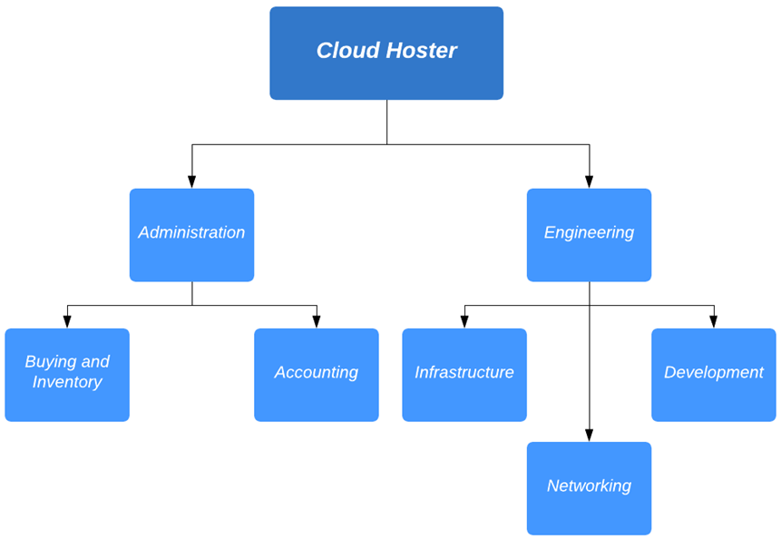

_Figure 2.1 – Cloud Hoster department diagram_

So, **Cloud Hoster** has some departments that need access to the Zabbix frontend and others who don't need it at all. Let's say we want to give the following departments access to the Zabbix frontend:

- **Networking**: To configure and monitor their network devices

- **Infrastructure**: To configure and monitor their Linux servers

- **Buying and Inventory**: To look at inventory information and compare it to other internal tools

### How to do it…

Let's get started with creating these three groups in our Zabbix UI:

1. ​	To do this, navigate to **Administration** | **User groups**, 	which will show you the following page:

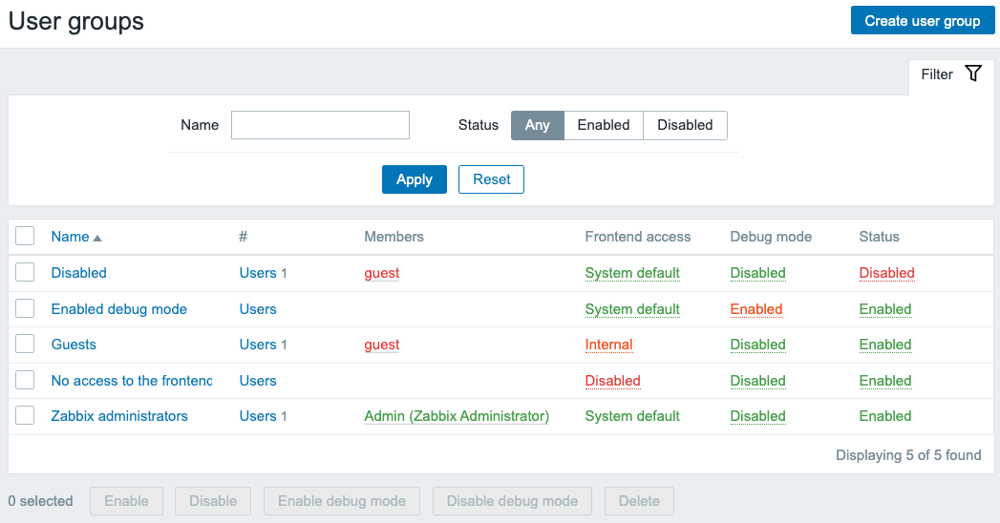

_Figure 2.2 – The Zabbix User groups window_

2.  Now, let's start by creating the **Networking** group by clicking **Create user group** in the top-right corner. This will bring you to the following screen:

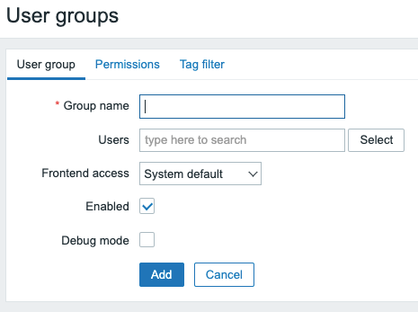

_Figure 2.3 – The Zabbix User groups configuration window_

We will need to fill in the information, starting with **Group name**, which of course will be Networking. There are no users for this group yet, so we'll skip that one. **Frontend access** is the option to provide us with authentication; if you select **LDAP** here, LDAP authentication will be used for authenticating. We will keep it as **System default**, which is the internal Zabbix authentication.

3.	Now, let's navigate to the next tab on this page, which is **Permissions**:

_Figure 2.4 – The Zabbix User groups Permissions configuration window_

Here, we can specify what host groups our group will have access to. There's a default host group for **Networking** already, which we will use in this example.

4. Click **Select** to take you to a pop-up window with host groups available. Select **Templates/Network devices** here and it'll take you back to the previous window, with the group filled in.
5. Select **Read-write** and click the smaller-text **Add** button to add these permissions.
6. We won't be adding anything else, so click the bigger blue **Add** button to finish creating this host group.

**Tip**

When using Zabbix authentication such as HTTP, LDAP, or SAML, we still need to create our users internally with the right permissions. Configure your users to match your authentication method's username in Zabbix and use the authentication method for password management.

​	Now we will have a new host group called **Networking** that is only allowed to read and write to the **Templates/Network devices** host group:

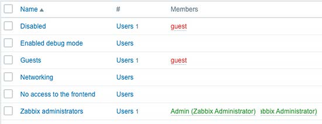

_Figure 2.5 – The Zabbix User groups window_

7.  Let's 	repeat this process for the **Infrastructure** 	host group, except instead of adding the **Templates/Network 	devices** 	host group, we'll add the **Linux 	servers** 	host group, like this:

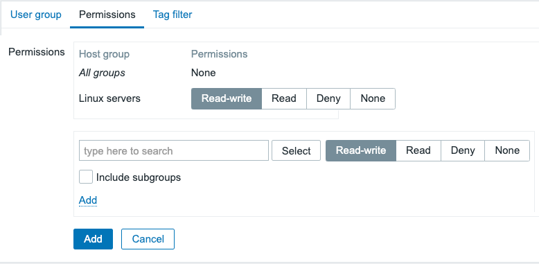

_Figure 2.6 – The Zabbix User groups Permissions configuration window with one host group_

8. Click **Add** to save this host group.

9.  Repeat the steps again and to add **Buying 	and Inventory**, 	we'll do something differently. We'll repeat the process we've just 	done except for the part with the permissions. We want **Buying 	and Inventory** 	to be able to read our inventory data, but we don't want them to 	actually change our host configuration. Add both **Templates/Network 	devices** 	and **Linux 	servers** 	to the group, but with only **Read** 	permissions like this:

_Figure 2.7 – The Zabbix User groups Permissions configuration window with two host groups_

Congratulations! Finishing this means you've ended up with three different host groups and we can continue to create our first new users! Let's get to it.

### There's more...

Zabbix user groups are quite extensive and there is a lot more to it than there seems at first. As the entire permission system is based on what user group(s) and user role(s) you are part of, it is always a good idea to read the Zabbix documentation first: [https://](https://www.zabbix.com/documentation/current/en/manual/config/users_and_usergroups/usergroup) [www.zabbix.com/documentation/current/en/manual/config/users_](https://www.zabbix.com/documentation/current/en/manual/config/users_and_usergroups/usergroup)

[and_usergroups/usergroup.](https://www.zabbix.com/documentation/current/en/manual/config/users_and_usergroups/usergroup)

## Using the new Zabbix user roles

New functionality has been introduced to this Zabbix 6.0 LTS release. It is now possible to create your own user roles in Zabbix. In older Zabbix versions, we had the ability to assign one of three user types:

- **User**

- **Admin**

- **Super admin**

What these user types did in earlier releases was restrict what Zabbix users could see in the frontend. This was always pre-defined though. Now with the addition of user roles that we can create ourselves, we can set up our own frontend-related restrictions, making it possible to only show certain parts of the UI to certain Zabbix users, while still respecting the permissions set up using user groups.

### Getting ready

For this recipe, we will need a Zabbix server, preferably the one set up in the previous recipe. In the previous recipe, we set up different user groups, to provide for different permissions on host groups. Completely separate from the user group, we will apply certain user roles to our users to determine what they can see in the UI. Let's check out how to set up our user roles.

### How to do it...

1. ​	First, navigate to the Zabbix frontend and go to **Administration** | **User roles**. This will show us the default user roles as you know them from older Zabbix versions.

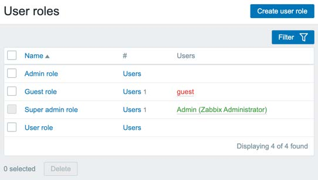

_Figure 2.8 – The default Zabbix User roles configuration window_

2. Here, we can click on the blue **Create user role** button in the top-right corner.

3.  We'll set up a new user role called User+ role. This role will be for Zabbix users that will only have read permissions, but who need more access than just the **Monitoring**, **Inventory**, and **Reports** navigational elements.

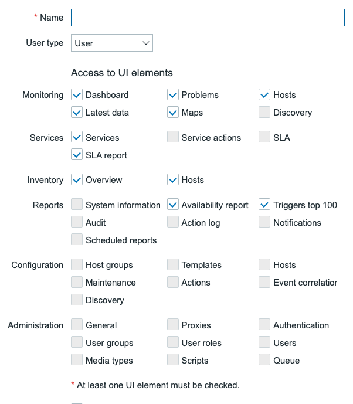

_Figure 2.9 – The top part of a new Zabbix User role configuration window_

4. First things first, make sure to fill out **Name** as User+ role.

5.  Let's focus on the part where it states **Access to UI elements** first. When **User** is selected for **User type**, we are not able to add some access to the user role. So let's change the **User type** by selecting **Admin** in the dropdown.

​	6.	I specifically want this user role named User+ role to have the ability to access the maintenance page. Setting this up will look like this:

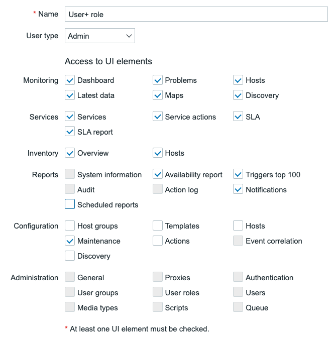

_Figure 2.10 – A new Zabbix User+ role with access to Maintenance_

7.  Make 	sure to also change the **Access 	to actions** 	section of the form by deselecting **Manage 	scheduled reports** 	as follows:

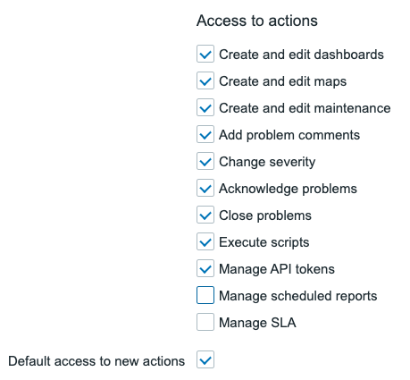

_Figure 2.11 – A new Zabbix User+ role with correct Access to actions settings_

8.  Last but not least, click on the blue **Add** button at the bottom of the form to add this new user role.

### How it works...

First, let's break down the options we have when creating user roles in Zabbix:

- **Name**: We can set a custom name for our user role here.
- **User type**: User types still exist in Zabbix 6, although now they are a part of user roles. There's still a limit to what can be seen by a certain user type and the Super admin type is still unrestricted when it comes to permissions.
- **Access to UI elements**: Here, we can restrict what a user can see on the Zabbix UI when they are assigned to this user role.
- **Access to services**: Service or SLA monitoring can be restricted here, as we might not want all users to have access to it.
- **Access to modules**: Custom Zabbix frontend modules are fully integrated into the user role system, meaning we can select what frontend modules a Zabbix user can see.
- **Access to API**: The Zabbix API can be restricted to certain user roles. For example, you might only want a specific API user role, limiting the rest of the users' access to the Zabbix API.
- **Access to actions**: In Zabbix user roles, certain actions can be limited, like the ability to edit dashboards, maintenance API tokens, and more.

Now, let's look at what we've changed between the user role called User role and the user role called User+ role. The default user role called User role has the following access to UI elements:

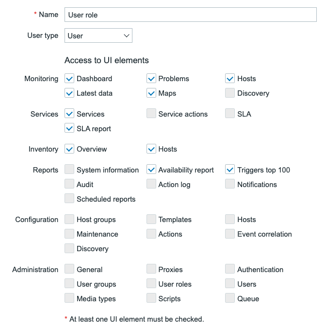

_Figure 2.12 – Default Zabbix user role called User role Access to UI elements_

By default, we have three user roles in Zabbix 6, which mirror the user types that are available. The user role we see here in **Name** mirrors the user type we have called User. It gives us access to the UI elements seen above, restricting the user role called User role to only be able to see certain things and make no configuration changes.

For example, it's considered an impactful permission to be able to set **Maintenance**. Because of course, you could restrict important notifications by setting **Maintenance**. But here comes the catch, what if you explicitly want a Zabbix user to only be able to read information but still not have access to configuration pages? In Zabbix 5.0, this wasn't possible because you could only select the **User**, **Admin**, or **Super admin** type, immediately giving access to the entire configuration section when using the **Admin** and **Super admin** user types.

Now, let's see what we did by creating a new user role called User+ role:

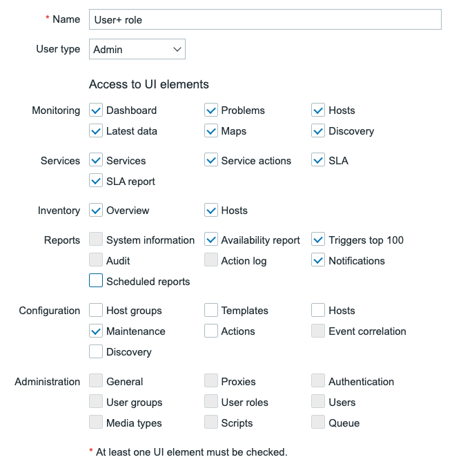

_Figure 2.13 – New Zabbix user role called User+ role Access to UI elements_

Here, we can see what happens if we change the user type to **Admin** but do not select all the available **Access to UI elements**. We now have a user role with no access to important configuration pages, but with access to **Maintenance**.

Combining that with the settings for **Access to actions**, where we added the **Create and edit maintenance** setting as seen in *Figure 2.11*, we would have full access to maintenance settings.

When we assign this role to a user in the next recipe and log in to that user, we will be able to see the following in our Zabbix sidebar.

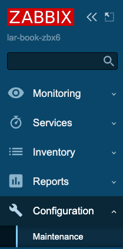

Figure 2.14 – Custom User role Zabbix sidebar

This, of course, is just one of the many types of configurations you can use. You have the ability to allow Zabbix users access to menus and options through a number of parameters under a bunch of custom user roles. You are free to set this up however you feel like, adding a lot of user flexibility within Zabbix.

### There's more...

Zabbix is currently in the process of working out user roles further, meaning that some parts might still be missing or you might see issues with them. As it is a new feature, it is constantly being improved and extended. Check out the Zabbix documentation for more information regarding this feature: [https://www.zabbix.com/documentation/](https://www.zabbix.com/documentation/current/en/manual/web_interface/frontend_sections/administration/user_roles) [current/en/manual/web_interface/frontend_sections/](https://www.zabbix.com/documentation/current/en/manual/web_interface/frontend_sections/administration/user_roles)

[administration/user_roles.](https://www.zabbix.com/documentation/current/en/manual/web_interface/frontend_sections/administration/user_roles)

## Creating your first users

​	With our newly created user groups, we've taken our first step toward a more structured and secure Zabbix setup. The next step is to actually assign some users to the newly created user groups to make sure they are assigned our new user permissions from the group.

### Getting ready

To get started, we'll need the server and the newly created user groups from the last recipe.

So, let's start the configuration.

Now we know there are three departments in the company called **Cloud Hoster** that are going to use our Zabbix installation. We've created host groups for them but there are also users in those departments that actually want to use our installation. Let's meet them:

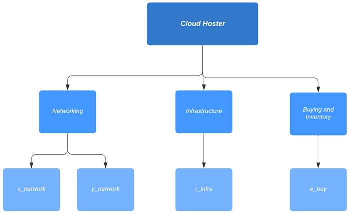

_Figure 2.15 – Cloud Hoster users diagram_

These are the users we need to configure for **Cloud Hoster** to use.

### How to do it…

Let's start creating the users. We will start with our **Networking** department:

1.	Navigate to **Administration** | **Users**, which will bring you to this page:

_Figure 2.16 – The Zabbix Users window_

2.  This is where all the user creation magic is happening, as we will be managing all of our users from this page. To create our first **Networking** department user named s_network, click the **Create user** button in the top-right corner, bringing us to the following screen:

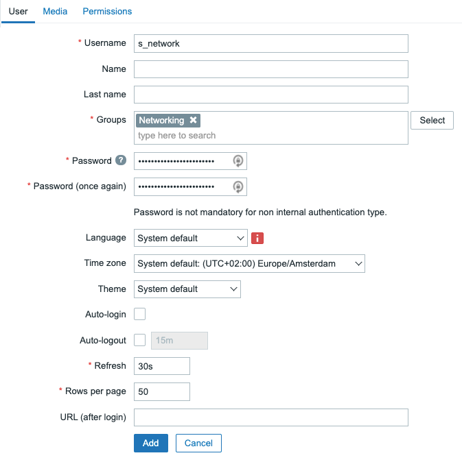

_Figure 2.17 – The Zabbix Users configuration window_

3. Fill out **Username** to provide us with the username this user will be using, which will be s_network.

4.  Also, it's important to add this user to the group we have just created to give our user the right permissions. Click **Select** and pick our group called **Networking**.

5. Last but not least, set a secure password in the **Password** fields; don't forget it because we will be using it later.

6. After this, move on to the **Permissions** tab as we won't be configuring **Media** just yet:

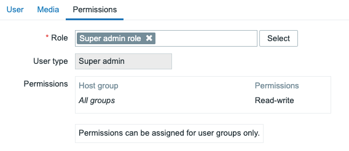

_Figure 2.18 – The Zabbix user Permissions configuration window_

7.  Select the **Role** option named **Super admin role** here. This will enable our user to access all UI elements and see and edit information about all host groups in the Zabbix server.

The following user roles are available in Zabbix by default:

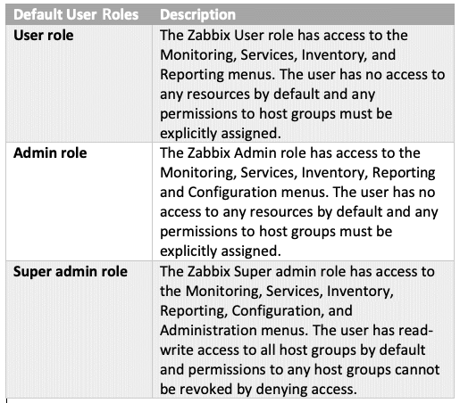

_Figure 2.19 – A table detailing the different Zabbix user roles_

8.  Let's 	repeat the previous steps for the user named 	y_network 	but in the **Permissions** 	tab, select the **Admin 	role** 	option like this:

_Figure 2.20 – The Zabbix user Permissions configuration window_

After creating these two users, let's move on to create the infrastructure user, r_ infra. Repeat the steps we took for s_network, changing the **Username**, of course. Then, add this user to the group and give our user the right permissions. Click **Select** and pick our group called **Infrastructure**. It will look like this:

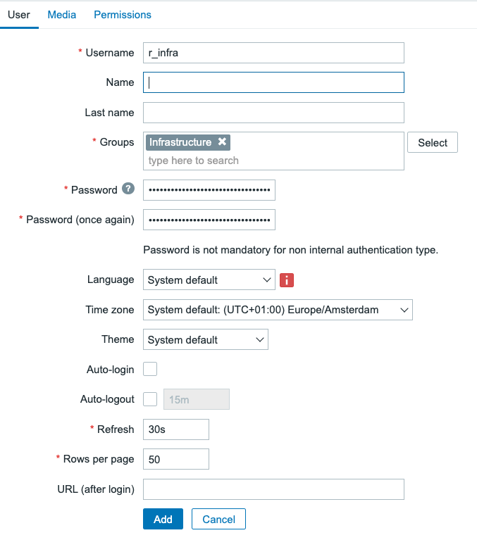

_Figure 2.21 – The Zabbix user configuration window for r_infra_

Lastly, make this user another **Super admin**.

9.  Now, for our last user, let's repeat our steps again, changing the **Username** and the group in the **User** tab like this:

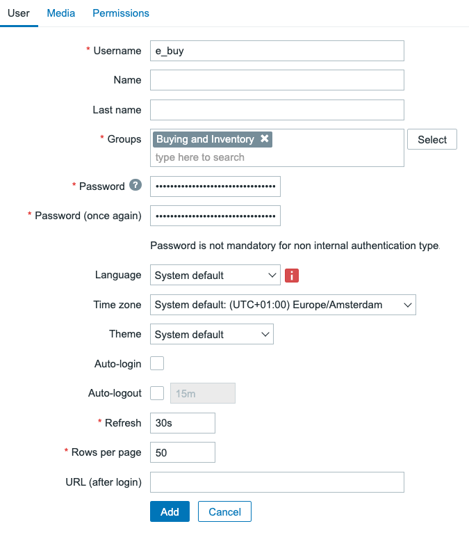

_Figure 2.22 – The Zabbix User configuration window for e_buy_

10.  If you didn't follow the previous recipe, you can change this user's 	**Role** 	to 	User role 	at the **Permissions** 	tab. But if you did follow the previous recipe, we can use 	the 	User+ role 	we created like this:

_Figure 2.23 – The Zabbix user configuration window for e_buy_

Setting the user up with the User+ role will also let the user e_buy create maintenance periods.

When you're done, you'll end up with the following:

- s_network: A user with access to the **Networking** user group permissions and that has the **Super admin** role.
- y_network: A user with access to the **Networking** user group permissions and that has the **Admin** role.
- r_infra: A user with access to the **Infrastructure** user group permissions and that has the **Super admin** role.
- e_buy: A user with access to the **Buying and Inventory** user group permissions and that has the User role or the User+ role.

## Advanced user authentication with SAML

In this recipe, we will use SAML authentication, a widely used form of authentication in the IT world. We'll be using this as a form of managing passwords for our Zabbix users. Please note that if you've worked with Zabbix before and you've configured LDAP, SAML, like LDAP, allows user authentication with passwords. You still have to create users with their permissions.

### Getting ready

To get started with SAML authentication, we will need our configured Zabbix server from the previous recipe. It's important that we have all the configured users from the previous recipe. We will also need something to authenticate with SAML. We will be using Azure **Active Directory** (**AD**) SAML.

Make sure to set up users in your (Azure) AD before continuing with this recipe. You can use your existing AD users for authentication, so you can use this recipe with your existing AD setup.

We will be using the s_network user as an example:

_Figure 2.24 – The Azure Users and groups window_

These are our user details:

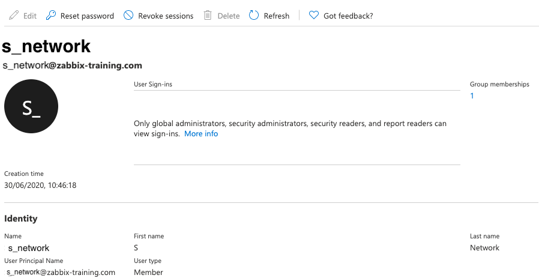

_Figure 2.25 – The Azure user details window_

To set up SAML, retrieve your SAML settings from your AD or another SAML provider.

To work with Zabbix, we will need the following:

- IdP entity ID

- SSO service URL

- SLO service URL

- Username attribute

- SP entity ID

- SP name ID format

### How to do it…

Now that we have our Azure AD ready, let's see how we can configure SAML using our setup:

1. Let's navigate to the following URL: portal.azure.com.

1. After logging in, navigate to Azure AD and click on **Enterprise Applications**.

1. Now click on **+ New Application** to create our new application. At the next window, click on **Create your own application**:

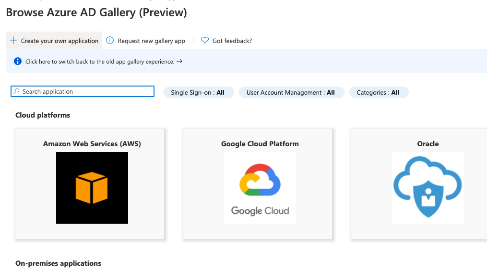

_Figure 2.26 – The Azure enterprise application creation page_

4. In the next window, name your new application Zabbix and click on the blue **Create** button:

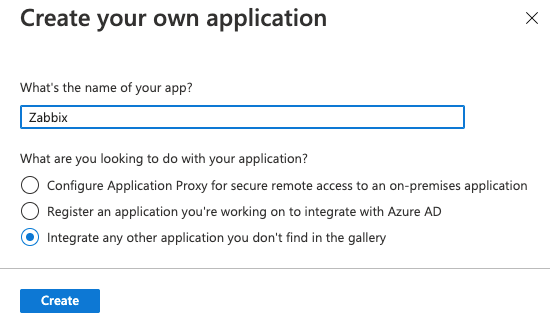

_Figure 2.27 – The Azure enterprise new application page_

5.  Select your new application from the list and click on **Assign Users and Groups** to add the correct users. In our case, this will be s_network:

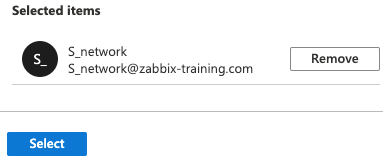

_Figure 2.28 – The Azure enterprise application Users and Groups page_

6. Click on **Select** and then **Assign**.

7. Now let's move on to the SAML settings by clicking on **Single sign-on** in the sidebar.

8. Now click on **SAML** on the page shown in the following screenshot and continue:

_Figure 2.29 – The Azure enterprise application SAML option_

9.  Now at **1**, 	we can add the following information, where the black marks are our 	Zabbix server URL:

_Figure 2.30 – The Azure SAML setting 1_

10. At **2**, fill out the following:

_Figure 2.31 – The Azure SAML setting 2_

11. Number **3** will be automatically filled. Click on **Download** for **Certificate (Base64)**:

_Figure 2.32 – The Azure SAML setting 3_

12.  Log in to the Zabbix server CLI and create a new file with the following command: **vim /usr/share/zabbix/conf/certs/idp.cert**
13. Paste the contents from the downloaded file in *Step 11* here and save the file.
14. Now back at Azure for **4**, we will get the following information:

_Figure 2.33 – The Azure SAML setting 4_

15.  At the Zabbix frontend, go to the **Administration** | **Authentication** | **SAML settings** page and fill in the following information and click on **Update**:

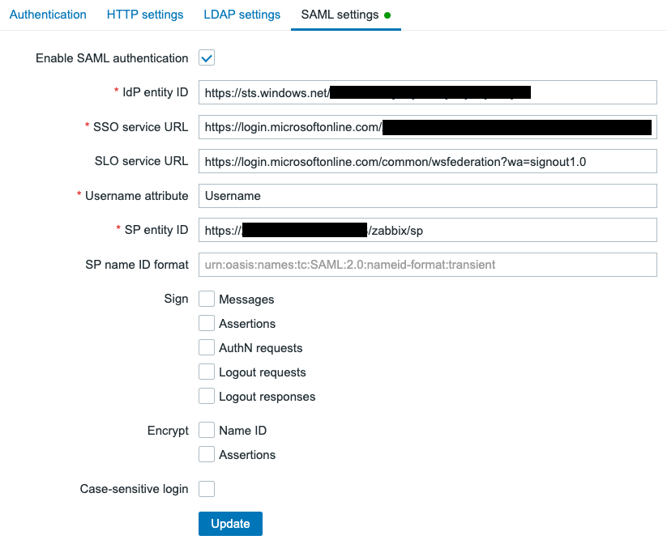

_Figure 2.34 – The Zabbix SAML settings_

16. Navigate 	to **Administration** 	| **Users** 	and change the 	s_network 	user to include the used Azure domain, for example:

_Figure 2.35 – The Zabbix edit user screen for our SAML setup_

17.  After following these steps, it should now be possible to log in with your user configured in Zabbix and use the password set in Azure AD for this:

_Figure 2.36 – The Zabbix login window_

### How it works…

Zabbix advanced user authentication is used to centralize password management. While we are not able to actually assign user groups and permissions to users via this setup, we can use it for password management.

This way, we can make sure it is easier for users to keep their passwords centralized in medium to big office environments:

_Figure 2.37 – Zabbix SAML authentication diagram_

Zabbix communicates with our Azure AD SAML component when we click the **Sign in** button. The user is then authenticated against your Azure AD user and a confirmation is sent back to the Zabbix server. Congratulations, you are now logged in to your Zabbix server!

### There's more…

We can do this kind of authentication not only with SAML but also with HTTP and LDAP. This way, you can choose the right form of advanced authentication for your organization.

Check out the Zabbix documentation for more information on the different forms of authentication:

[https://www.zabbix.com/documentation/current/en/manual/web_](https://www.zabbix.com/documentation/current/en/manual/web_interface/frontend_sections/administration/authentication) [interface/frontend_sections/administration/authentication](https://www.zabbix.com/documentation/current/en/manual/web_interface/frontend_sections/administration/authentication)

It's also possible to work with an identity provider such as Okta, OneLogin, or any other. Meaning your options aren't limited to Azure AD, as long as it supports SAML you can use it to authenticate against your Zabbix server.
